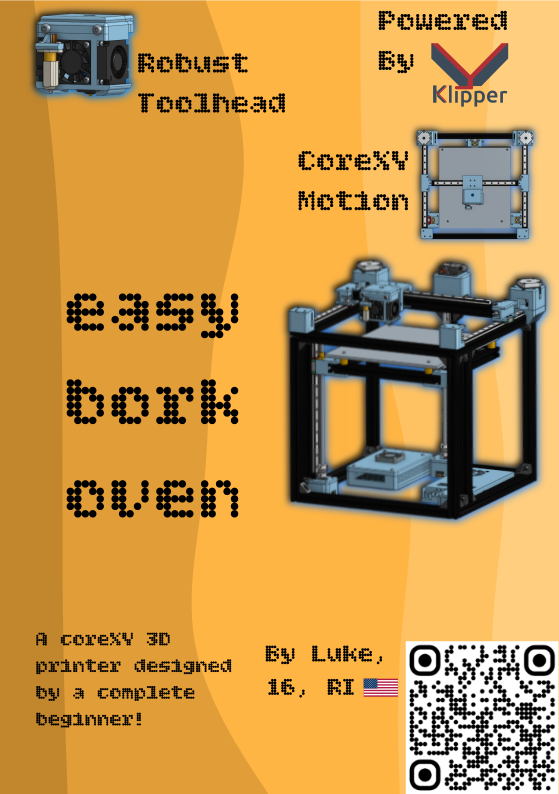

A 3D printer that works

## The Origin
I've always wanted to make a 3D printer from scratch, because the idea of making a machine that has the capability to make machines has always fascinated me. I already own an Ender 3 V2 and have upgraded the living shit out of it, but bed slingers can only do so much, especially speed wise. I've wanted to mess around with a CoreXY printer for awhile now, so when the opportunity came to build one for free, at 
<a href="https://fallout.hackclub.com">Hack Club</a> came around, I said, "Hell yeah!" I'm 16 years old and COMPLETELY new to engineering, so I did what anyone else would, and designed a corexy 3d printer which I'm calling the *Easy Bork Oven*. It's designed to be semi-fast and reliable, with reliability improving with upcoming iterations after the initial build.

EBO(Easy Bork Oven) Is built with purely klipper in mind. It's equipped with the Octopus v1.1 motherboard, and an auto leveling system. Combining everything together and attaching it to the rasberry pi for klipper, makes it an absolute *beast*. **DISCLAIMER: MANY MOUNTS AND SCREWS ARE SUBJECT TO CHANGE DURING THE BUILD PHASE**

## Specifications
 - 3 Lead screw Z axis
 - BL-Touch
 - Draognfly BMS hotend
 - CoreXY system
 - xx*xxmm build volume(not definite until initial build completion)
 - 350W PSU
 - Air cooled Octopus v1.1 motherboard
 - Sturdy bed frame
 - Dual gear, all metal extruder
 - Dual 4010 part cooling fans
 - 60W Heating Cartridge
 - 100W heated bed safely up to about 150c
 - Controlled in a web browser with Klipper

## CAD and CAD Notes

Before opening the CAD files, please note:

 - There are several models that are designed to be representing parts with less complexity, for example a cylinder in place of a T80 threaded rod
 - The extruder model in the CAD model is single gear but the one in the BOM will be dual gear, they fit the same.
 - Screw hole sizes may be adjusted after/during the initial build to best deal with tolerances.
 - Heatead Inserts are not included in the model(complexity reasons)
 - T-Nuts for the extrusions are not included in the model(complexity reasons)
 - Belts and teflon tube are not included in the model(complexity reasons)
 - The rasberry pi and case are not included in the model(complexity reasons and it's an entirely seperate device connected to the printer)
 - The Octopus v1.1 is not included(do to complexity, meaning lag reasons)
 - The idlers are all smooth to reduce complexity in modeling, the ones in the x carriage are toothed and the ones in the idler blocks are smooth

### <a href="https://cad.onshape.com/documents/cc22fae3a41d1b35fbb4d10a/w/27f7108179307e350a4ce97b/e/54f56ee9e3916d8b65554994">CAD in onshape</a>

## Complete BOM
| Category            | Item                      | Link                                                                                                                                                                                                                                                                                    | price(USD) | amount | notes                      |
|---------------------|---------------------------|-----------------------------------------------------------------------------------------------------------------------------------------------------------------------------------------------------------------------------------------------------------------------------------------|------------|--------|----------------------------|
|                     |                           |                                                                                                                                                                                                                                                                                         |            |        |                            |
| Aluminum Extrusions | 2020 1000mm extrusion     | https://www.aliexpress.us/item/3256809599498642.html?spm=a2g0o.cart.0.0.64b338dalpoJ2K&mp=1&pdp_npi=6%40dis%21USD%21USD%20106.97%21USD%2055.06%21%21USD%2055.06%21%21%21%40210328d417759370502288446e4c7f%2112000050149933276%21ct%21US%216216336952%21%211%210%21&gatewayAdapt=glo2usa | 48.92      | 1      | cut down later             |
| Electronics         | LRS 350-24 PSU            | https://www.aliexpress.com/item/3256807372225491.html?spm=a2g0o.detail.0.0.5dc85S1K5S1Kxv&mp=1&pdp_npi=6%40dis%21USD%21USD%2026.63%21USD%2026.63%21%21USD%2026.63%21%21%21%402101ef5e17759373186073295ea076%2112000041287857212%21ct%21US%216216336952%21%211%210%21                    | 26.63      | 1      |                            |
| Electronics         | Octopus V1.1              | https://www.aliexpress.com/item/3256802425039425.html?spm=a2g0o.detail.0.0.5ae6axY1axY1sy&mp=1&pdp_npi=6%40dis%21USD%21USD%2093.73%21USD%2089.04%21%21USD%2089.04%21%21%21%402101ef5e17759376931791784ea076%2112000029815078844%21ct%21US%216216336952%21%211%210%21                    | 82.34      | 1      |                            |
| Motors              | Nema 17 Stepper Motor  42 | https://www.aliexpress.com/item/3256803312215323.html?spm=a2g0o.detail.0.0.5ae6JcZjJcZjiP&mp=1&pdp_npi=6%40dis%21USD%21USD%2041.00%21USD%2034.85%21%21USD%2034.85%21%21%21%402101ef5e17759374787286029ea076%2112000051241194033%21ct%21US%216216336952%21%211%210%21                    | 34.85      | 1      | only the first 5           |
| Motors              | Nema 17 stepper Motor 42  | https://www.aliexpress.com/item/3256809869361476.html?spm=a2g0o.detail.0.0.7ac3RJMgRJMghm&mp=1&pdp_npi=6%40dis%21USD%21USD%2013.05%21USD%209.13%21%21USD%209.13%21%21%21%402101d9ef17759380999946191e4ffb%2112000050972531695%21ct%21US%216216336952%21%211%210%21                      | 9.13       | 1      | 6th extruder               |
| Mounts              | 2020 Extrusion Connector  | https://www.aliexpress.com/item/3256808438307479.html?spm=a2g0o.detail.0.0.30bbg8WHg8WHds&mp=1&pdp_npi=6%40dis%21USD%21USD%2024.49%21USD%2011.17%21%21USD%2011.17%21%21%21%402101d9ef17759384288205225e4ffb%2112000046001833295%21ct%21US%216216336952%21%213%210%21                    | 33.51      | 3      | price is price for 3 packs |
| Fans                | 5010 Fan                  | https://www.aliexpress.com/item/2251832622488883.html?spm=a2g0o.detail.0.0.6217AQJdAQJdvG&mp=1&pdp_npi=6%40dis%21USD%21USD%202.77%21USD%202.77%21%21USD%202.77%21%21%21%402101d9ef17759386173408627e4ffb%2166026863908%21ct%21US%216216336952%21%211%210%21                             | 1          | 1      |                            |
| Motors              | T80 Screw Couplers        | https://www.aliexpress.com/item/3256807634078328.html?spm=a2g0o.detail.0.0.5313p6aop6aoQz&mp=1&pdp_npi=6%40dis%21USD%21USD%203.19%21USD%203.19%21%21USD%203.19%21%21%21%402101d9ef17759386792311864e4ffb%2112000042324936327%21ct%21US%216216336952%21%213%210%21                       | 3.19       | 3      |                            |
| Linear Rails        | mgn12 Linear Rails 300mm  | https://www.aliexpress.com/item/2255800077919268.html?spm=a2g0o.cart.0.0.7edc38daK3quIp&mp=1&pdp_npi=6%40dis%21USD%21USD%2029.72%21USD%2022.59%21%21USD%2022.59%21%21%21%402101d6ff17759388925621794e0dc6%2112000029914284790%21ct%21US%216216336952%21%213%210%21                      | 135.54     | 6      | price is for 6 packs       |
| Motors              | 300mm Lead Screws         | https://www.aliexpress.com/item/2251832695820276.html?spm=a2g0o.detail.0.0.11e1SKQSSKQS3g&mp=1&pdp_npi=6%40dis%21USD%21USD%207.44%21USD%206.84%21%21USD%206.84%21%21%21%402101e80317759397684193478e0049%2110000001851292042%21ct%21US%216216336952%21%212%210%21                       | 13.68      | 2      | price is for 2 packs       |
| Motors              | T8 Brass Nuts             | https://www.aliexpress.com/item/3256808498256838.html?spm=a2g0o.detail.0.0.1521McinMcinBR&mp=1&pdp_npi=6%40dis%21USD%21USD%205.38%21USD%205.38%21%21USD%205.38%21%21%21%402101e80317759399599638099e0049%2112000046231334677%21ct%21US%216216336952%21%211%210%21                       | 5.38       | 1      |                            |
| Bed                 | Aluminum Bed Surface      | https://www.aliexpress.com/item/3256811596661293.html?spm=a2g0o.detail.0.0.31beC627C627UA&mp=1&pdp_npi=6%40dis%21USD%21USD%2083.06%21USD%2034.83%21%21USD%2034.83%21%21%21%402101e80317759400352601868e0049%2112000056560135226%21ct%21US%216216336952%21%211%210%21                    | 34.83      | 1      |                            |
| Bed                 | Spacers                   | https://www.aliexpress.com/item/3256804911079455.html?spm=a2g0o.detail.0.0.14acEaFbEaFbLB&mp=1&pdp_npi=6%40dis%21USD%21USD%208.29%21USD%203.20%21%21USD%203.20%21%21%21%402101e80317759401552364252e0049%2112000031647396583%21ct%21US%216216336952%21%211%210%21                       | 3.2        | 1      |                            |
| Bed                 | Bed Heater 100w 24v       | https://www.aliexpress.com/item/2255800598394856.html?spm=a2g0o.detail.0.0.14acEaFbEaFbLB&mp=1&pdp_npi=6%40dis%21USD%21USD%2018.99%21USD%2017.09%21%21USD%2017.09%21%21%21%402101e80317759401552364252e0049%2110000007813902794%21ct%21US%216216336952%21%211%210%21                    | 17.09      | 1      |                            |
| Pulley              | 2GT pulley                | https://www.aliexpress.com/item/3256805281443612.html?spm=a2g0o.detail.0.0.3feenw8rnw8r6t&mp=1&pdp_npi=6%40dis%21USD%21USD%201.96%21USD%201.96%21%21USD%201.96%21%21%21%402101eede17759403848575491ee652%2112000033199614758%21ct%21US%216216336952%21%212%210%21                       | 3.92       | 2      | price is for 2 packs       |
| Pulley              | Toothless Idler W6B5      | https://www.aliexpress.com/item/3256804706692592.html?spm=a2g0o.detail.0.0.36d0GyDeGyDet7&mp=1&pdp_npi=6%40dis%21USD%21USD%204.58%21USD%203.21%21%21USD%203.21%21%21%21%402101eede17759406108928911ee652%2112000030918802955%21ct%21US%216216336952%21%214%210%21                       | 12.84      | 4      | price is for 4 packs       |
| Pulley              | Toothed Idler W6B5        | https://www.aliexpress.com/item/3256807370977153.html?spm=a2g0o.detail.0.0.6f68MQ0bMQ0bf7&mp=1&pdp_npi=6%40dis%21USD%21USD%206.24%21USD%200.99%21%21USD%200.99%21%21%21%402101eede17759407775203184ee652%2112000041284399158%21ct%21US%216216336952%21%211%210%21                       | 1          | 1      |                            |
| Pulley              | 5m W6 Belt                | https://www.aliexpress.com/item/3256807159304191.html?spm=a2g0o.detail.0.0.6f37eWHqeWHqY8&mp=1&pdp_npi=6%40dis%21USD%21USD%2014.83%21USD%2012.60%21%21USD%2012.60%21%21%21%402101e07217759410746911919ebb38%2112000040356416505%21ct%21US%216216336952%21%211%210%21                    | 12.6       | 1      |                            |
| Head                | BL-Touch                  | https://www.aliexpress.com/item/2251832772360454.html?spm=a2g0o.detail.0.0.45d3z29Hz29H1F&mp=1&pdp_npi=6%40dis%21USD%21USD%208.19%21USD%208.19%21%21USD%208.19%21%21%21%402101e07217759411962454364ebb38%2112000018444154247%21ct%21US%216216336952%21%211%210%21                       | 1.49       | 1      |                            |
| Head                | Hotend                    | https://www.aliexpress.com/item/3256808140610752.html?spm=a2g0o.detail.0.0.7483dej9dej9oU&mp=1&pdp_npi=6%40dis%21USD%21USD%20120.27%21USD%2060.14%21%21USD%2060.14%21%21%21%402101e07217759412836835929ebb38%2112000044615321846%21ct%21US%216216336952%21%211%210%21                   | 60.14      | 1      |                            |
| Head                | Fans                      | https://www.aliexpress.com/item/3256808117811654.html?spm=a2g0o.detail.0.0.4ae47TIB7TIBgg&mp=1&pdp_npi=6%40dis%21USD%21USD%207.00%21USD%207.00%21%21USD%206.93%21%21%21%402101e07217759414015967943ebb38%2112000044554942271%21ct%21US%216216336952%21%212%210%21                       | 14         | 2      | price for 2 packs          |
| Head                | Fan                       | https://www.aliexpress.com/item/3256803185681643.html?spm=a2g0o.detail.0.0.863b5Igg5Igg3J&mp=1&pdp_npi=6%40dis%21USD%21USD%201.47%21USD%201.47%21%21USD%201.47%21%21%21%402101e07217759414853621710ebb38%2112000025471466561%21ct%21US%216216336952%21%211%210%21                       | 1          | 1      |                            |
| Heated Inserts      | Heated Inserts            | https://www.aliexpress.com/item/3256806350792745.html?spm=a2g0o.detail.0.0.465cu3zzu3zzRp&mp=1&pdp_npi=6%40dis%21USD%21USD%2033.84%21USD%2033.11%21%21USD%2033.11%21%21%21%402103119c17760035398096823e213b%2112000037574038170%21ct%21US%216216336952%21%211%210%21                    | 26.41      | 1      |                            |
| Total               |                           |                                                                                                                                                                                                                                                                                         | 582.69     |        |                            |
 
## The beautiful Zine ;)

